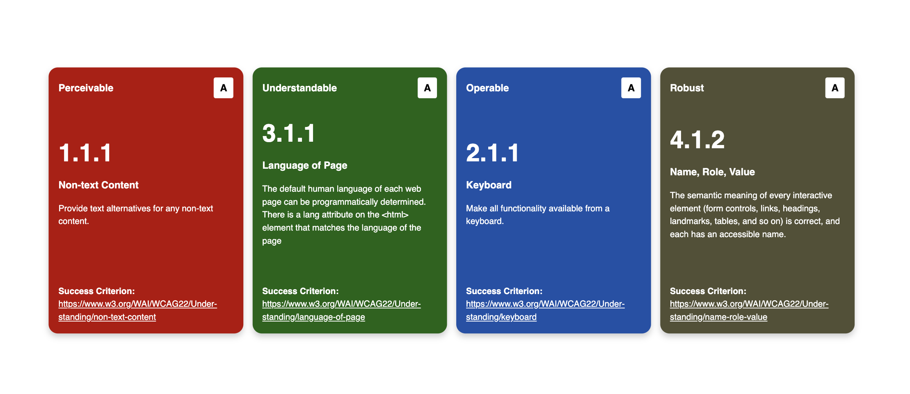

<div align="center">
  <br />
    <a href="https://www.npmjs.com/package/a11y-wcag" title="Open npm package on new tab" target="_blank">
      
    </a>
  <br />

  <div>
    
  </div>

  <h1 align="center">a11y-wcag</h1>

   <div align="center">
     A cool way of having always wcag close
    </div>
</div>

## <a name="table">Table of Contents</a>

1. [Quick Start](#quick-start)
2. [Troubleshooting](#troubleshooting)
3. [More](#more)

## <a name="quick-start">Quick Start</a>

**Prerequisites**

Make sure you have the following installed on your machine:

- [Git](https://git-scm.com/)
- [Node.js](https://nodejs.org/en)
- [npm](https://www.npmjs.com/) (Node Package Manager)

**Install the package**

```bash
npm i a11y-wcag
```

**Use in the project**

If you are using a simple vanilla JavaScript/TypeScript project, you just need to add the following in the `html file`.

```html
<wcag-card size="small" criterion="1.1.1"></wcag-card>
```

- The attribute size is optional (by default, it will take 'medium'). You can choose between `small`, `medium` and `large`.
- The criterion should be one of the available in the [WCAG 2.2 Standard](https://www.w3.org/WAI/WCAG22/Understanding/). For example, 4.1.1 is obsolete and therefore not here.

## <a name="troubleshooting">Troubleshooting</a>

If you are using some frameworks/libraries like React, Astro or Svelte, you might come up with some problems because of the nature of web components. Depending on the framework, you should look for a different solutions (Astro uses some kind of `Astro.glob()` method and with React I could `lazy import` the `index.js` of the web component from the `node_modules`).

All in all, I do not recommend for the moment the use of the package with a framework/library.

## <a name="more">More</a>

I was deeply inspired by the amazing Figma design by <a title="Open the Figma Design of Johannes Lehner on a new tab" target="_blank" rel="nofollow noopener" href="https://www.figma.com/community/file/1409436654182046971/wcag-2-2-card-deck">Johannes Lehner</a>.

Also thanks to <a  title="Open the page of Thomas Puppe on a new tab" target="_blank" rel="nofollow noopener" href="https://www.thomaspuppe.de/">Thomas Puppe </a> for the amazing idea of creating web components for the cards!
